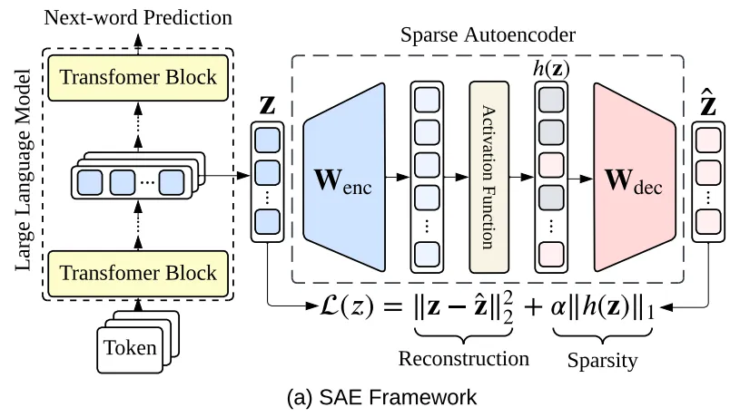

# Sparse Autoencoders

多义性（polysemanticity）：神经元常在语义无关的语境中激活（如同一神经元既响应 “人名” 又响应 “数字”

叠加（superposition）导致多义性

## 流程
  - 介绍 Vanilla SAE $$z=\mathrm{ReLU}(W_\text{enc}(x-b_\text{pre})+b_\text{enc})\\\hat{x}=W_\text{dec}z+b_\text{pre}$$
  - 侧重不同模型、不同任务上的应用（LLM、LVLM、Diffusion Model、Text-to-Image Model），要了解具体的 metric，关注性能比较，关注一下计算资源
    - LLM：1（讲基础的preliminary）
    <!-- - Vision Foundation Model：21-->
    - CLIP：3、14、28、47
    - LVLM：16、34、47
    - Stable Diffusion：17、**High-resolution image synthesis with latent diffusion models**、**37**、**SDXL**

## 1. Sparse autoencoders find highly interpretable features in language models (ICLR 2024)

- 使用 SAE 解释小型 LM
- SAE 架构设计：
  - 挑选输入层：语言模型内部激活（残差流、MLP 子层、注意力头子层）
  - 内部稀疏表征：$d_{\mathrm{hid}}=R\times d_{\mathrm{in}}$，ReLU 激活，实现超完备表征
  - 编码器和解码器权重绑定：编码器矩阵$M\in\mathbb{R}^{d_{\mathrm{hid}}\times d_{\mathrm{in}}}$，解码器矩阵$M^\top$，① 减半内存消耗；② 明确特征方向（避免编码器 / 解码器歧义）；③ 残差流训练无性能损失 $$\mathbf{c}=\mathrm{ReLU}(M\mathbf{x}+\mathbf{b})\\\hat{\mathbf{x}}=M^\top\mathbf{c}=\sum_{i=1}^{d_{\mathrm{hid}}-1}c_i\mathbf{f}_i\\\mathcal{L}(\mathbf{x})=\|\mathbf{x}-\hat{\mathbf{x}}\|_2^2+\alpha\|\mathbf{c}\|_1$$
  - 残差流$\alpha=8.6e-4$，MLP $\alpha=3.2e−4$
  - 对$M$进行行归一化，防止模型通过增大特征向量规模来降低稀疏损失
  - 自动可解释性评分：
#### 评论：局限性之一 —— 重构损失非零

## 2. Improving Sparse Decomposition of Language Model Activations with Gated Sparse Autoencoders (NeurIPS 2024)
- 为鼓励稀疏性施加的 L1 惩罚会导致收缩偏差（系统低估特征激活幅度），需在重建保真度与稀疏性间妥协，损害分解准确性。
- 将传统 SAE 编码器的 “特征激活判断” 与 “幅度估计” 功能分离，仅对前者施加 L1 惩罚，减少偏差影响范围 $$\mathbf{\tilde{f}}(\mathbf{x})\coloneqq\mathbb{1}[(\mathbf{W}_{\mathrm{gate}}(\mathbf{x}-\mathbf{b}_{\mathrm{dec}})+\mathbf{b}_{\mathrm{gate}})>0]\odot\mathrm{ReLU}(\mathbf{W}_{\mathrm{mag}}(\mathbf{x}-\mathbf{b}_{\mathrm{dec}})+\mathbf{b}_{\mathrm{mag}})$$
- 为避免参数激增，采取权重共享方案
$$(\mathbf{W}_{\mathrm{mag}})_{ij}\coloneqq(\exp(\mathbf{r}_\mathrm{mag}))_i\cdot(\mathbf{W}_\mathrm{gate})_{ij}$$
- $$\mathcal{L}_\mathrm{gated}(\mathbf{x})\coloneqq\|\mathbf{x}-\hat{\mathbf{x}}(\mathbf{\tilde{f}}(\mathbf{x}))\|_2^2+\lambda\|\mathrm{ReLU}(\pi_\mathrm{gated}(\mathbf{x}))\|_1+\|\mathbf{x}-\hat{\mathbf{x}}_\mathrm{frozen}(\mathrm{ReLU}(\pi_\mathrm{gated}(\mathbf{x})))\|_2^2$$

## 3. **Interpreting CLIP with Sparse Linear Concept Embeddings (SpLiCE) (NeurIPS 2024)**
- 提出**任务无关、无需训练**的方法，将 CLIP 嵌入分解为**稀疏、非负、人类可解释**的概念组合
- 稀疏分解的四个充分条件
  - 图文在概念空间稀疏，即潜在概念向量 $\omega$ 的非零元素数 $\|\omega\|_0\le \alpha$（$\alpha \ll \text{概念总数} k$）
  - CLIP 仅捕获语义概念，忽略非语义噪声（如光照、相机角度）
  - CLIP 在概念空间线性（符合 “线性表示假设”）
  - CLIP 图文编码器对齐（需预处理解决模态间隙）
  - 实验验证：将两张图片（或两段文本）拼接，对比组合嵌入与个体嵌入加权平均的相似度，发现权重接近**0.5**
- 方法
  - 选择 LAION-400m 文本标注中最频繁的 1-2 字短语（bigrams）；移除 NSFW 样本；剔除相似度 > 0.9 的概念；
  - 模态对齐预处理：图像嵌入和文本嵌入分布在单位球的 “不同锥面” 上 —— 图像 - 图像、文本 - 文本的跨样本余弦相似度集中于正值，而图像 - 文本的相似度集中于 0
    - 图像嵌入中心化：计算 MSCOCO 训练集所有图像嵌入的均值$\mu_{img}$，将待分解的图像嵌入减去该均值得到中心化嵌入 $z=\sigma(z^{img}-\mu_{img})$
    - 概念词典中心化：词典矩阵 $C$ 减去词典中所有概念嵌入的均值
    - 分解得到概念权重 $w^*$ 后，$\hat{z}^{img}=\sigma(Cw^*+\mu_{img})$
  - 稀疏性与语义重建的权衡 $$\min_{w\in\mathbb{R}_+^c}\|Cw-z\|_2^2+2\lambda\|w\|_1$$
#### 评论：预先定义码本，不需要额外解释特征，但重建误差较大，可解释性局限于码本概念

## 4. Identifying Functionally Important Features with End-to-End Sparse Dictionary Learning (NeurIPS 2024)
- 传统 SAE 因聚焦激活重构而优先学习数据集结构，忽略网络功能重要特征
- 通过最小化原始模型与插入 SAE 后模型的输出分布 KL 散度训练 SAE $$\mathcal{L}_\text{e2e+ds}=\text{KL}(\hat{y},y)+\phi\|Enc(a^{(l)})\|_1+\frac{\beta_l}{L-l}\sum_{k=l+1}^{L-1}\|\hat{a}^{(k)}-a^{(k)}\|_2^2$$
- 增加下游层重构损失：防止模型通过非原始计算路径实现输出分布匹配（如利用下游层未被原模型使用的变换）
#### 评论：仍需要保证特征准确重构

## 5. Codebook features: Sparse and discrete interpretability for neural networks (ICML 2024)

- 输入：隐藏层激活向量 $a\in\mathbb{R}^N$，码本 $C={c_1,c_2,...,c_C}\in\mathbb{R}^{C\times N}$
- 根据余弦相似度，用 top-k 个最相似码向量的和替换 $a$ (k 控制稀疏度)
- 基于预训练模型微调，在注意力头和/或 MLP 块插入码本，保留残差流完整性
- $$\mathcal{L}=-\sum_{i=1}^N\log p_\theta(x_i|x_{<i})+\lambda\cdot\text{MSE}(\mathcal{C}(x),\text{stop-gradient(x)})$$

#### 评论：和之前的 end-to-end SAE 类似

## 6. Interpreting Attention Layer Outputs with Sparse Autoencoders (ICML 2024)

- 将 SAE 应用于注意力层输出（并非传统的 MLP 或残差流），揭示注意力层学习的核心概念
- 输入项：**Scaled Dot-Product Attention** 输出后拼接的、过线性层之前的输出 $\mathbf{z}_\text{cat}$
- 重构公式：$$\mathbf{z}_\text{cat}=\mathbf{\hat{z}_\text{cat}}+\epsilon(\mathbf{z}_{cat})=\sum_{i=0}^{d_\text{sae}}f_i(\mathbf{z}_\text{cat})\mathbf{d}_i+\mathbf{b}+\epsilon(\mathbf{z}_\text{cat})$$ $\epsilon(\mathbf{z}_\text{cat})$ 是误差项
- 归因技术
  - 基于权重的头归因：将特征方向 $\mathbf{d}_i$ 拆分为各头的子向量 $\mathbf{d}_{i, j}$，计算头 $k$ 的贡献占比 $h_{i, k}=\frac{\|\mathbf{d}_{i,k}\|_2}{\sum_{j=1}^{n_\text{heads}}\|\mathbf{d}_{i,j}\|_2}$
  - 直接特征归因（DFA）：按照头位置分解 SAE 预激活 $f_i^{\text{pre}}(\mathbf{z}_\text{cat})=\mathbf{w}_i^\top\mathbf{z}_\text{cat}=\mathbf{w}_{i,1}^\top\mathbf{z}_1+\mathbf{w}_{i,2}^\top\mathbf{z}_2+\cdots+\mathbf{w}_{i,n_\text{heads}}^\top\mathbf{z}_{n_\text{heads}}$
  - 递归 DFA：冻结注意力模式 / LayerNorm，线性追溯特征至上游残差流、组件及早期 token
- 结论
  - 多义性：对 GPT-2 Small 仅发现 14 个单义候选头（Top10 归因特征高度相关），至少 90% 的头存在多义性
  - 层间功能规律：
    - 早期层（0-3）：语法特征（单 token、bigram）+ 简单实体跟踪；
    - 中期层（4-9）：复杂语义（动词家族、推理短语、时间关系）；
    - 晚期层（10-11）：语法调整、bigram 补全 + 少量长程上下文跟踪。
#### 评论：未覆盖 Transformer 的 QK 电路等关键组件；SAE 的线性分解可能无法捕捉注意力层的非线性计算

## 7. Scaling and evaluating sparse autoencoders (ICLR 2025)
- 重建与稀疏性目标难以平衡，需调优L1正则系数；大规模训练中死潜变量多；现有研究仅聚焦小规模 SAE
- **k-Sparse SAE**
  - 编码器仅保留前 k 个最大潜变量激活，解码器不变 $$\mathbf{z}=\text{TopK}(W_\text{enc}(\mathbf{x}-\mathbf{b}_\text{pre}))\\\hat{\mathbf{x}}=W_\text{dec}\mathbf{z}+\mathbf{b}_\text{pre}$$
  - 编码器 - 解码器转置初始化
  - 利用死潜变量重建误差，使死潜变量获得梯度信号 $\mathcal{L}_\text{aux}=\|(\mathbf{x}-\hat{\mathbf{x}})-\mathbf{W}_\text{dec}\mathbf{z}_\text{dead}\|_2^2$

## 8. Sparse Feature Circuits: Discovering and Editing Interpretable Causal Graphs in Language Models (ICLR 2025)
- 粗粒度组件分析具有多义性；基于神经元、线性探测的细粒度方法依赖人工设计标注

## 9. Efficient Dictionary Learning with Switch Sparse Autoencoders (ICLR 2025)

- 密集编码器前向传播是时间瓶颈，潜变量预激活存储是内存瓶颈
- 路由网络 + 多专家 SAE
  - 仅激活一个专家

## 10. Rethinking Evaluation of Sparse Autoencoders through the Representation of Polysemous Words (ICLR 2025)

- 现有评估无法直接验证 SAE 是否实现 “提取单义特征” 的核心目标。提出聚焦多义词的 SAE 评估框架 **PS-Eval**。

## 11. Sparse Autoencoders Reveal Temporal Difference Learning in Large Language Models (ICLR 2025)
- “仅训练下一个 token 预测的模型为何能实现 RL” 的机制未知
- 验证 LLM 是否自发涌现时序差分（ TD ）学习机制。

## 12. Towards Principled Evaluations of Sparse Autoencoders for Interpretability and Control (ICLR 2025)

- SAE 缺少 Ground Truth 导致评估困难
  - 任务属性参数化：选择任务相关的、人类可理解的属性（如 IO 任务的 IO/S/Pos），确保属性能完全捕捉任务关键信息。
  - 构建监督特征字典
  - 无监督字典评估：以监督字典为基准，从三个维度（重建的必要性 / 充分性、属性稀疏可控性、因果一致性可解释性）评估 SAE，且评估过程不依赖特征的人工解释（如可控性测试通过优化特征子集实现属性编辑，无需知道特征对应哪个属性）。

## 13. Sparse Autoencoders Do Not Find Canonical Units of Analysis (ICLR 2025)
- **Motivation**
  - 机械可解释性的核心诉求：将 LLM 的激活分解为 “规范分析单元”—— 即满足**唯一性**（无变体）、**完整性**（覆盖所有必要特征）、**原子性**（不可再分）的可解释特征。
  - 此前假设“足够大的 SAE 字典能够找到规范单元”未被验证
- 验证完整性：通过在不同字典大小的 SAE 间插入 / 替换潜变量，观察重构性能变化，以分类大 SAE 的潜变量类型。
- 验证原子性：**meta-SAEs**
  - meta-SAEs 的训练数据并非 LLM 激活，而是另一 SAE 的解码器矩阵 $\mathbf{W_\text{dec}}$ —— 即把大 SAE 的每个潜变量（对应 $\mathbf{W_\text{dec}}$ 的一列）作为训练样本，目标是学习对这些潜变量的稀疏分解。
- 结论：小 SAE 不完整，大 SAE 非原子性

## 14. **Sparse autoencoders reveal selective remapping of visual concepts during adaptation (ICLR 2025)**
- CLIP 通过提示适配可以高效适配下游任务，需要研究其内部表征在适配过程中如何变化；提出针对 CLIP ViT 的 Patch-SAE，能够提取细粒度（如形状、颜色、语义）的可解释视觉概念及补丁级空间归因；分析 CLIP 在分类任务中的行为
- **Patch-SAE**：包含图像 token 的 SAE 
  - 输入：冻结 CLIP ViT-B/16 的第 11 层（倒数第二层）残差流输出，包含 1 个 [CLS] token + 14×14=196 个图像 token，每个 token 维度 $d_\text{ViT}=768$。
  - 编码器：$W_E \in \mathbb{R}^{d_\text{ViT}\times d_\text{SAE}}$
  - 激活函数：$\phi$ ReLU
  - 解码器：$W_D\in\mathbb{R}^{d_\text{SAE}\times d_\text{ViT}}$ $$\text{SAE}(\mathbf{z})=W_D^\top\phi(W_E^\top\mathbf{z})$$ $$\mathcal{L}_\text{SAE}=\|\text{SAE}(\mathbf{z})-\mathbf{z}\|_2^2+\lambda_{l_1}\|\phi f(\mathbf{z})\|_1$$

- **分析 SAE 的 latents**

  - 对于每个 SAE 的潜变量（共 $d_\text{SAE}$ 个），将能最大程度激活该 SAE 潜变量的 top-k 图像作为参考图像（共 $d_\text{SAE}\times k$ 张图像）
  - 计算激活分布的汇总统计
    - **Sparsity**：表示该 latent 被激活的频率。高频的 latent 可能代表一个常见概念或一个无法解释的噪声
    - **Mean activation value**：对激活样本中的正激活值取平均值来计算。反应了 SAE 的置信度。如果一个 latent 有比较高的平均激活值，则它更有可能代表一个有意义的概念
    - **Label entropy**：衡量有多少个不同的标签激活了 latent。熵为零表示所有参考图像都具有相同的标签。熵值越高代表有更多标签对 latent 的激活有贡献。
    - **Label standard deviation**
  - 将 patch-level 激活转化为图像级激活、类别级激活、数据集级激活
    - 使用一个较小的阈值 $\tau$，对第 i 张图的第 j 个 token 的激活向量二值化 $$\mathbf{a}_{i,j}[s]=\mathbb{I}(\mathbf{h}_{i,j}[s]>\tau),\text{ where }1\le s\le d_\text{SAE}$$ $$\mathbf{a}_i[s]=\sum_{j=1}^{n_i}\mathbf{a}_{i,j}[s],\ \mathbf{a}_c[s]=\sum_{i\in\mathcal{I}_c}\mathbf{a}_i[s],\ \mathbf{a}_D[s]=\sum_{i\in D}\mathbf{a}_i[s]$$
  - Localizing
    - 对于第 s 个 latent 和图像 $x_i$，利用激活值 $\mathbf{h}_{i,j}[s]$ 可以在图像中突出显示对应概念

- **研究 SAE latents 与分类任务下模型行为之间的关系**
  - 将 CLIP 图像编码器的**中间层表示**替换为 SAE 重构的输出，观察性能 —— SAE latents 包含类别判别信息
  - CLIP 和 MaPLe 中激活度最高的 SAE latents 大多重叠
  - CLIP 和 MaPLe 中 top 的 SAE latents 影响不同：MaPLE 比 CLIP 更有效地利用了相同数量的 SAE 潜在变量进行分类
  - 基于提示的 Adaptation 通过优化常见激活概念与下游任务类别之间映射关系，带来性能提升

#### 评论：有许多高标签熵的 latent 无法解释

## 15. Residual Stream Analysis with Multi-Layer SAEs (ICLR 2025)
- 传统 SAE 仅在单个 Transformer层的激活向量上训练，无法研究信息在跨层残差流中的流动与变化；现有研究推测模型可能**通过多层同时激活编码语义概念**，单层 SAE 无法捕捉该特征
- 基于残差流理论：Transformer 通过自注意力和 MLP 层选择性读写残差流信息，且相邻层残差流向量应具有较高相似性
- **MLSAE** 在所有层的残差流激活向量上训练，且参数跨层共享

## 16. **SAE-V: Interpreting Multimodal Models for Enhanced Alignment (ICML 2025)**

- 挑战
  - 解决多模态大语言模型因图像模态融入导致的可解释性与可控性差
  - 单模态 SAE 无法分离 MLLM 中的跨模态特征
- **SAE-V** 的核心应用：数据过滤算法
  - 特征激活 Token 收集
    - 采样数据集子集 $\mathcal{D}_S$，输入 MLLM 获得隐藏态 $H$，SAE-V 编码得到 $Z$，收集激活特征对应的 Token（$z_{jk}>\delta$，$\delta$ 为激活阈值）
    - 获取全数据集的特征激活样本
  - 跨模态权重计算
    - 对每个特征 $f_k$，取 Top-K 文本 Token（$\mathcal{A}_k\cap\mathcal{T}$）与 Top-K 视觉 Token（$\mathcal{A}_k\cap\mathcal{V}$），计算余弦相似度作为权重 $\omega_k$
    - 量化特征捕捉跨模态信息的能力
  - 数据排序
    - 对每条数据，求和其激活特征 $\omega_k$ 作为分数，按分数排序筛选高质量数据
- 局限：
  - 理论基础不足：SAE-V 的图像 - 文本相似度 metric、跨模态共现特征与模型性能的数学关系未完全揭示
  - 模态仅覆盖文本 - 图像模态

## 17. **SAeUron: Interpretable Concept Unlearning in Diffusion Models with Sparse Autoencoders (ICML 2025)**

- 挑战
  - 现有机器遗忘方法缺乏透明度，易“掩盖”而非“移除”概念易受对抗攻击，难同时遗忘多概念。
  - 基于 SAE 的扩散模型可解释概念遗忘方法。
- **SAeUron**
  - 架构
    - 激活数据来源：Stable Diffusion 的交叉注意力块，提取多去噪步骤（t=1 至 50）的特征图（形状 $F_t\in\mathbb{R}^{h\times\omega\times d}$），每个特征向量（d维）作为 SAE 训练样本。$$\mathbf{z}=\text{TopK}(W_\text{enc}\mathbf{x}-\mathbf{b}_\text{pre})\\\mathbf{\hat{x}}=W_\text{dec}\mathbf{z}+\mathbf{b}_\text{pre}\\\mathcal{L}(\mathbf{x})=\|\mathbf{x}-\mathbf{\hat{x}}\|_2^2+\alpha\mathcal{L}_\text{aux}$$
    辅助损失防止死潜变量
  - 目标概念特征选择
    - 识别对目标概念激活强、对其他概念激活弱的 SAE 特征
    - 评分函数：$$\text{score}(i,t,c,\mathcal{D})=\frac{\mu(i,t,\mathcal{D}_c)}{\sum_{j=1}^n\mu(j,t,\mathcal{D}_c)+\delta}-\frac{\mu(i,t,\mathcal{D}_\neg c)}{\sum_{j=1}^n\mu(j,t,\mathcal{D}_\neg c)+\delta}$$
    其中 $\mu(i,t,\mathcal{D})$ 为特征 $i$ 在数据集 $\mathcal{D}$、步骤 $t$ 的平均激活，$\delta$ 防止除零。
    - 选择评分最高的 $\tau_c$ 个特征。
  - 推理时概念遗忘流程
    - 在扩散模型的目标交叉注意力块与下一块间插入训练好的 SAE
    - 在验证集 $\mathcal{D}$，对于要遗忘的概念 $c$，得到表示该概念的 SAE 特征集合 $\mathcal{F}_c$ $$\mathcal{F}_c\coloneqq\{i|i\in\text{Top-}\tau_c(\{\text{score}(i,t,c,\mathcal{D})\})\}\\\mu(i)\coloneqq\mu(i,t,\mathcal{D}),\space\space\forall i\in\mathcal{F}_c$$
    - 特征消融：对编码后的 latent 特征，若特征 i 属于目标集合 $\mathcal{F}_c$ 且激活 $>$ 平均激活 $\mu(i,t,\mathcal{D})$，则用负乘数缩放：$$f_i(\mathbf{x})=\begin{cases}\gamma_c\mu(i,t,\mathcal{D}_c)f_i(\mathbf{x}), & \text{if}\ i\in\mathcal{F}_c\ \land\ f_i(\mathbf{x})>\mu(i,t,\mathcal{D}), \\ f_i(\mathbf{x}) & \text{otherwise}.
\end{cases} $$
    - 解码回传：修改后的 latent 经解码器重建，传入下一个扩散块，保留非目标特征的正常激活。
- **支持多概念遗忘；具有对抗鲁棒性**
#### 局限性：生成速度轻微减慢；依赖大量数据；抽象概念（仇恨、暴力）难处理；相似特征彼此干扰（猫和狗特征重叠，遗忘狗会影响猫的生成）

## 18. Archetypal SAE: Adaptive and Stable Dictionary Learning for Concept Extraction in Large Vision Models (ICML 2025)

- 在类似的数据集上训练的相同 SAE 模型可以产生截然不同的字典
- **A-SAE**
  - 通过几何约束设计解决该问题：借鉴原型分析，强制字典原子 $\bm D = \bm W\cdot\bm A$（$\bm W$ 为行随机矩阵），使每个原子严格处于数据的凸包（$\text{conv}(\bm A)$） 内。
  - 这种 “几何锚定” 从本质上限制原子偏离数据分布：
    - 一方面，数据微小扰动时，原子变化被 $\bm W$ 的行随机属性约束；
    - 另一方面，重建结果 $\bm Z\bm D$ 始终处于数据锥包（$\text{cone}(\bm A)$）内，避免生成 “脱离数据的异常方向”，最终使稳定性提升至 0.92 以上（接近传统 NMF）。
- **RA-SAE**
  - 允许原子轻微偏离凸包，匹配传统 SAE 的重建性能

## 19. SAEBench: A Comprehensive Benchmark for Sparse Autoencoders in Language Model Interpretability (ICML 2025)
- 传统评估依赖无监督代理指标，单一指标无法覆盖可解释性、特征解纠缠等实际需求
- 4 大评估能力与 8 个指标详解
  - 概念检测：Sparse Probing、Feature Absorption
  - 可解释性：Automated Interpretability
  - 重建能力：Loss Recovered、稀疏度 - 保真度权衡
  - 特征解纠缠：Unlearning、SCR（伪相关移除）、TPP（目标探针扰动）、RAVEL

## 20. From Mechanistic Interpretability to Mechanistic Biology: Training, Evaluating, and Interpreting Sparse Autoencoders on Protein Language Models (ICML 2025)
- 略

## 21. **Universal Sparse Autoencoders: Interpretable Cross-Model Concept Alignment (ICML 2025)**

- 传统解释方法仅针对单模型，跨模型概念分析依赖“事后挖掘 - 匹配”，效率低，无统一空间。
学习多个视觉模型的一个通用概念空间
- **USAE**
  - 符号定义：$\bm A^{(i)}\in\mathbb{R}^{n\times d_i}$ 为第 $i$ 个模型对 $n$ 个样本的激活矩阵；$\bm Z\in\mathbb{R}^{n\times m}$ 为所有模型共享的概念编码。
  - 编码过程：每个模型 $i$ 有专属编码器 $\Psi_\theta^{(i)}$ $$\bm Z=\Psi_\theta^{(i)}(\bm A^{(i)})=\text{TopK}(\bm W_\text{enc}^{(i)}(\bm A^{(i)}-\bm b^{(i)}_\text{pre}))$$
  - 解码过程：每个模型 $j$ 有专属解码器 $\bm D^{(j)}\in\mathbb{R}^{d_j\times m}$ $$\widehat{\mathbf{\mathit{A}}}^{(j)}=\bm Z\bm D^{(j)}$$
  - 训练损失：随机选择一个模型 $i$ 编码，计算所有模型 $j$ 的重构误差之和 $$\mathcal{L}_\text{Universal}=\sum_{j=1}^M\|\bm A^{(j)}-\bm\Psi_\theta^{(i)}(\bm A^{(i)})\bm D^{(j)}\|_F$$
  （平衡计算效率与跨模型对齐，保证各编码器 / 解码器更新次数均等）
  - **关键应用：协同激活最大化**
    - 每个模型 $i$，输入 $x$，对概念维度 $k$，$\bm Z^{(i)}_k(\bm x)=\left[\bm\Psi_\theta^{(i)}\left(\bm f^{(i)}(\bm x)\right)\right]_k$
    - 基于通用概念空间，对同一概念维度 $k$，独立优化每个模型的输入 $\bm x^{(i)}$，最大化该维度激活，同时使用正则项 $\mathcal{R}(\bm x)$ 保证输入自然：$$\bm x_*^{(i)}=\argmax_{\bm x\in\mathcal{X}}\bm Z_k^{(i)}(\bm x^{(i)})-\lambda \mathcal{R}(\bm x^{(i)})$$
    - 价值：可视化同一概念在不同模型中的编码差异。
- 实验模型：DinoV2，SigLIP，ViT
#### 局限：仅探索最后一层特征

## 22. Learning Multi-Level Features with Matryoshka Sparse Autoencoders (ICML 2025)

- 扩大字典规模时，稀疏性目标（L1 正则化或 L0 约束）会引发三大问题
  - 特征分裂：通用概念拆分为多个特定特征，高层概念缺失
  - 特征吸收：通用特征出现漏洞，部分特例被细分特征吸收
  - 特征组合：独立概念合并为符合特征，丢失底层独立特征
- SAE 字典扩大虽然降低训练损失，但下游任务性能下降
- **Matryoshka SAE**
  - 通过多个递增规模的嵌套子 SAE，在单一特征空间同时保留抽象（通用）和具体（细分）特征
  - 给定最大字典规模 m，嵌套字典尺寸序列 $\mathcal{M}=m_1,m_2,...,m_n$（$m_1<m_2<...<m_n=m$）
  - 强制多尺度重建：$$\mathcal{L}(\mathbf{x})=\sum_{m\in\mathcal{M}}\|\mathbf{x}-(\mathbf{f}(\mathbf{x})_{0:m}\mathbf{W}^\text{dec}_{0:m}+\mathbf{b}^\text{dec})\|_2^2+\alpha\mathcal{L}_\text{aux}$$ $\mathcal{L}_\text{aux}$ 为死潜变量的辅助损失
  - 采用 **BatchTopK**：保留 batch 中 $B\times K$ 个最大激活
- 局限性
  - 重建性能较差，不适用于需精确激活重建的场景
  - 嵌套目标增加训练时间
  - 可解释性评估依赖定量指标和自动化评分，缺乏人类手动验证

## 23. AxBench: Steering LLMs? Even Simple Baselines Outperform Sparse Autoencoders (ICML 2025)
- 现有 LLM 控制技术存在明显局限
  - 提示工程易被越狱，全参数微调依赖高质量数据集且模型行为不可解释
  - SAE、Linear Steering Vector 等表示型方法，因缺乏统一评估基准，性能无法与传统方法直接对比
  - 需要在开放词汇、长文本生成场景下，系统性评估表示型转向技术是否可替代传统控制方法
- AxBench
  - 数据生成流程
    - genre 标注：为每个概念分配文本 / 代码 / 数学三类 genre
    - 正负样本生成（包含概念/不包含概念）
  - 评估维度
    - 概念检测：给定模型表示，判断是否含目标概念（二分类）
    - 模型转向：干预模型表示，使输出融入目标概念

## 24. Scaling Sparse Feature Circuits For Studying In-Context Learning (ICML 2025)

- Motivation
  - 现有 SAE 在 LLM 可解释性中的局限 —— 要么仅解读单个 SAE 特征，要么仅做高层干预。
  - 使用 SAEs 来加深对 ICL 机制的理解（分解任务向量、发现 ICL 关键组件、验证组件间因果关系）
- 任务执行特征的发现
  - 由于任务向量对于 SAE 而言是分布外输入（聚合了来自不同残差流的信息而不是代表单一残差流）
  - **Task Vector Cleaning (TVC)**：为任务向量 $v_{tv}$ 生成优化后的 SAE 分解权重 $\theta\in\mathbb{R}^{d_\text{SAE}}$
    - 用 $v_{tv}$ 的 SAE 分解权重初始化 $\theta$
    - 用 $\theta$ 重建新的任务向量 $v_\theta$，在一批零样本提示上用 $v_\theta$ 驱动模型，并计算其负对数似然损失 $\mathcal{L}_\text{NLL}(\theta)$
    - 优化 $\theta$ 以最小化 $\mathcal{L}=\mathcal{L}_\text{NLL}(\theta)+\lambda\|\theta\|_1$

## 25. Sparse Autoencoders, Again? (ICML 2025)
- SAE 依赖超参且损失非凸；VAE 虽无超参且损失平滑，但仅支持固定稀疏性
- **VAEase**

## 26. Low-Rank Adapting Models for Sparse Autoencoders (ICML 2025)

- 当 SAE 重构结果插入 LM 前向传播时，交叉熵损失远高于原始模型损失，传统方法训练成本极高
- 核心方法：LoRA 适配 LM 以优化 SAE
  - 冻结预训练 LM 和预训练 SAE，仅训练 LoRA
  - 最小化 SAE 插入后与原始 LM 的输出分布差异

## 27. Sparse Autoencoders for Hypothesis Generation (ICML 2025)

- 挖掘文本与目标变量的可解释关系

## 28. **Interpreting CLIP with Hierarchical Sparse Autoencoders (ICML 2025)**

- CLIP 因其**分布式表示**和复杂损失函数导致解释性差；传统 SAE 需要权衡稀疏性和重构
- **Matryoshka SAE（MSAE）**
  - 多粒度 latent 表示：对输入 $x$，用递增的 $k$ 值（$k_1<k_2<...<k_h\le d$）生成 $h$ 个 latent 向量：$$z_i=\mathrm{ReLU}(\mathrm{TopK}_i(W_\text{enc}(x-b_\text{pre})+b_\text{enc}))\\\hat{x}_i=W_\text{dec}z_i+b_\text{pre}$$ $$\mathcal{L}(x)\coloneqq\sum_{i=1}^h\alpha_i\|x-\hat{x}_i\|_2^2$$
  - 分层特征连贯性：$\text{TopK}_1\subseteq\text{TopK}_2\subseteq...\subseteq\text{TopK}_h$，低 $k$ 捕捉粗概念（如“动物”），高 $k$ 捕捉细特征（如“猫”）
  - 对嵌入进行中心化，解决[模态间嵌入 Gap](#center)；通过数据集计算的缩放因子对中心化后的嵌入进行缩放，使得 $\mathbb{E}_{x\in\mathcal{X}}[\|x\|_2]=\sqrt{n}$
  - 训练时使用图像模态计算的均值和缩放因子；文本嵌入推理时应用文本特定的均值和缩放因子；推理阶段，移出 TopK 约束，使模型能够仅基于 ReLU 激活自适应地选择活跃特征的数目
- CLIP 解释与应用场景
  - 概念提取与命名
    - 用 CLIP 嵌入与 MSAE 解码器的列向量计算相似度，结合阈值筛选
    - 概念类型覆盖颜色、物体、场景、抽象概念、地域等，且跨图像 - 文本模态一致
  - 概念级相似性搜索
    - 相比 CLIP 的黑箱搜索，MSAE 可解释匹配原因（如检索“爱尔兰警车”时，显示共享“ireland”“police”“foodtruck”等概念）
    - 可控性：调整概念强度（如增大“germany”概念权重），可使检索结果从“英国警车”转向“德国警车”，且保持图像结构不变。
  - 下游任务偏见分析（CelebA 性别分类）
    - 基于 CLIP 嵌入训练单层分类器，用 MSAE 分析概念与性别的关联
#### 评论：多粒度解码需要多次前向传播；就是将 MSAE 应用到 CLIP 理解上

## 29. Jacobian Sparse Autoencoders: Sparsify Computations, Not Just Activations (ICML 2025)

- 传统 SAE 虽能将 LLM 的 latent 激活分解为稀疏、可解释的特征，但仅关注“表示”而非“计算过程”（无法解释 MLP 如何将输入 latent 映射到输出 latent）；需要设计一种方法，在稀疏化输入 / 输出激活的同时，稀疏化两者之间的连接计算（形式化为 **Jacobian 矩阵**）
- **Jacobian SAE（JSAE）**
  - 针对 MLP 层 $f: \mathcal{X}\rightarrow\mathcal{Y}$，训练两个 **$k$-sparse SAEs**
  - 输入 SAE 和输出 SAE：$$\mathbf{s_x}=e_\mathbf{x}(\mathbf{x}),\ \hat{\mathbf{x}}=d_\mathbf{x}(\mathbf{s_x})\\\mathbf{s_y}=e_\mathbf{y}(\mathbf{y}),\ \hat{\mathbf{y}}=d_\mathbf{y}(\mathbf{s_y})$$
  - 定义 $f_s:S_X\rightarrow S_Y$，即对 SAE 学习到的稀疏激活的映射 $$f_s=e_\mathbf{y}\circ f\circ d_\mathbf{x}\circ\tau_k$$ $\tau_k$ 为 TopK 激活函数
  - High level 上，我们希望 $f_s$ 是“稀疏的”，每个输入维度只影响输出维度的一小部分（**计算图稀疏性**）$$J_{f_s,i,j}=\frac{\partial f_{s,i}(s_\mathbf{x})}{\partial s_{\mathbf{x},j}}$$
  - $$\mathcal{L}=\mathrm{MSE}(\mathbf{x}-\hat{\mathbf{x}})+\mathrm{MSE}(\mathbf{y}-\hat{\mathbf{y}})+\frac{\lambda}{k^2}\sum_{i=1}^{n_y}\sum_{j=1}^{n_x}|J_{f_s,i,j}|$$ 除以 $k^2$ 是因为 Jacobian 矩阵最多只有 $k^2$ 个非零元素

#### 评论：用 Jacobian 矩阵稀疏化近似计算图稀疏化，并非完美度量

## 30. Compute Optimal Inference and Provable Amortisation Gap in Sparse Autoencoders (ICML 2025)

- 传统 SAE 预测稀释编码与最有稀疏编码存在差距

## 31. Are Sparse Autoencoders Useful? A Case Study in Sparse Probing (ICML 2025)

- Motivation
  - 缺乏 Ground Truth 验证 SAE 是否真正提取 LLM 的可解释概念
  - 利用 LLM activation probing 任务验证 SAE 的实用性
- Probing
  - 113 个二分类 probing 数据集，含语法、情感、事实等任务；AUC 评估分类器区分正负例的能力
  - 流程
    - 每个类别的LLM 激活（最后 token）过 SAE 编码器生成 latent
    - 选择类别间差异最大的 TopK 个latent，训练 L1 正则化逻辑回归探测器

## 32. Constrain Alignment with Sparse Autoencoders (ICML 2025)

- LLM 对齐存在缺陷
  - RLHF：需构建奖励模型与策略梯度更新，导致计算复杂度高、训练不稳定
  - DPO：对参考模型的约束强度敏感，且可控性有限
  - SimPO：缺乏参考约束导致训练不稳定
  - TDPO：token 级序列 KL 约束，需处理大规模词汇
- **FPO**
  - 统一损失框架：
  - **TODO**

## 33. The Complexity of Learning Sparse Superposed Features with Feedback (ICML 2025)
- **TODO**

## 34. **SAUCE: Selective Concept Unlearning in Vision-Language Models with Sparse Autoencoders (ICCV 2025)**

- Motivation
  - VLMs 需要对隐私属性、版权元素、有害内容等概念进行 Unlearning
  - 现有方法依赖大量标注数据；粗粒度操作导致过度遗忘
- **SAUCE**

  - 无监督训练 [vanilla SAE](#vanilla-sae) 捕获视觉稀疏特征 
    - hook VLMs **视觉编码器**的**倒数第二层残差流**，获取高层语义特征（避免浅层特征噪声）
    - ImageNet-1k，“Please describe this figure”；扩展因子 64，训练两轮，批次大小 1024，仅更新 SAE 参数；LLaVA-v1.5-7B 上约 54 小时，LLaMA3.2-11B-Vision-Instruct 上约 72 小时（单卡 H100）
    - $\mathcal{L}(x)=\|\mathbf{x}-\hat{\mathbf{x}}\|_2^2+\alpha\cdot\|z_1\|_1$
  - 基于相关性的目标特征选择（类似 [SAeUron](#saeuron)）
    - 数据集构建：对于每个任务，使用其训练集，为目标概念 $c$ 构建正数据集 $\mathcal{D}_c$ 和负数据集 $\mathcal{D}_{nc}$
    - 特征重要性评分：$$S(i,c,\mathcal{D})=\frac{\mu(i,\mathcal{D}_c)}{\sum_{j=1}^n\mu(j,\mathcal{D}_c)+\delta}-\frac{\mu(i,\mathcal{D}_{nc})}{\sum_{j=1}^n\mu(j,\mathcal{D}_{nc})+\delta}$$
    - 选择评分 Top-k 的特征作为目标概念 $c$ 的关键特征集 $\mathcal{F}_c$ $$\mathcal{F}_c\coloneqq\{\text{index}_i\ |\ i\in\{1,...,k\}\}$$
  - 推理时特征干预
    - 对于 SAE 特征 $z_i$，如果属于集合 $\mathcal{F}_c$，则乘负的缩放因子 $\gamma$ $$z_i=\begin{cases}\gamma z_i, & \text{if}\ i\in\mathcal{F}_c \\ z_i, & \text{otherwise}.
\end{cases} $$
- 实验数据集
  - 具体概念 Unlearning：物体、运动场景
  - 抽象概念 Unlearning：颜色、情绪、材质
- 评估指标
  - 生成式 Unlearning 准确率
  - 判别式 Unlearning 准确率
  - 同一领域内非目标概念的保留比例
  - 不同领域非目标概念的保留比例
  - MME

#### 评价：仅探索 ViT 的倒数第二层

## 35. Unveiling Language-Specific Features in Large Language Models via Sparse Autoencoders (ACL 2025)
- Motivation
  - 多语言能力的内在机制解析
  - 基于神经元的方法：识别“语言特定神经元”分析机制，但受叠加问题影响，单神经元可能编码多个无关概念导致分析结果不可靠
- **TODO**

## 36. Disentangling Superpositions: Interpretable Brain Encoding Model with Sparse Concept Atoms (NeurIPS 2025)
- 略

## 37. **One-Step is Enough: Sparse Autoencoders for Text-to-Image Diffusion Models (NeurIPS 2025)**
- Motivation
  - 文本到图像模型内部生成逻辑缺乏理解
  - 以少步扩散模型 **SDXL Turbo** （1-4步生成）为对象，验证 SAEs 分解其中间特征的可行性
- 方法
  - SAEs 训练细节
    - 训练对象：SDXL Turbo U-net 中 4 个高影响 Cross-attention Transformer 块的残差更新
    - **TODO**：看 SDXL 架构

## 38. **SAEMark: Steering Personalized Multilingual LLM Watermarks with Sparse Autoencoders (NeurIPS 2025)**

- 面向多语言 LLM 的推理时多 bit 水印框架
- **TODO**

## 39. **Transformer Key-Value Memories Are Nearly as Interpretable as Sparse Autoencoders (NeurIPS 2025)**
- Transformer 的 FF 层可天然分解神经激活（视为“键值记忆” FF-KV），其原生特征的可解释性是否能与 SAEs 媲美？
- FF 层首先将 FF 输入 $\bm x_{\text{FF}_\text{in}}\in\mathbb{R}^{d_\text{model}}$ 投影到 $d_\text{FF}$ 维表示，然后应用逐元素非线性激活 $\bm\phi(\cdot):\mathbb{R}^d\rightarrow\mathbb{R}^d$，再将其投影回去：$$\bm x_{\text{FF}_\text{out}}=\bm\phi(\bm x_{\text{FF}_\text{in}}\bm W_K+\bm b_K)\bm W_V+\bm b_V=\sum_{i\in d_\text{FF}}\bm\phi(\bm x_{\text{FF}_\text{in}}\bm W_K)_{[i]}\bm W_{V[:,i]}+\bm b_V$$
- FF-KV 变体设计
  - **Vanilla FF-KV**
    - 直接将 key activations 视为特征，将 value vectors 视为特征向量
  - **TopK FF-KV**
    - $$\bm x_{\text{FF}_\text{out}}\approx\text{Top-}k(\bm\phi(\bm x_{\text{FF}_\text{in}}\bm W_K+\bm b_K)){\bm{W}}_V+\bm b_V$$
  - **Normalized FF-KV**
    - $$\bm x_{\text{FF}_\text{out}}\approx\text{Top-}k(\bm\phi(\bm x_{\text{FF}_\text{in}}\bm W_K+\bm b_K)\odot\bm s)\tilde{\bm{W}}_V+\bm b_V$$
- 使用 SAEBench 评估
  - FF-KV 完美重构，低冗余

#### 评价：可以用到 LVLM 幻觉分析以弥补 FF 层幻觉分析的缺失

## 40. Sparse Diffusion Autoencoder for Test-time Adapting Prediction of Spatiotemporal Dynamics (NeurIPS 2025)

- 高维复杂系统预测
- **TODO**

## 41. From Flat to Hierarchical: Extracting Sparse Representations with Matching Pursuit (NeurIPS 2025)
- **TODO**

## 42. Revising and Falsifying Sparse Autoencoder Feature Explanations (NeurIPS 2025)

- **TODO**

## 43. Projecting Assumptions: The Duality Between Sparse Autoencoders and Concept Geometry (NeurIPS 2025)

## 44. Proxy-SPEX: Sample-Efficient Interpretability via Sparse Feature Interactions in LLMs (NeurIPS 2025)

## 45. A is for Absorption: Studying Feature Splitting and Absorption in Sparse Autoencoders (NeurIPS 2025)

## 46. **Sparse Autoencoders Learn Monosemantic Features in Vision-Language Models (NeurIPS 2025)**

- 缺乏神经元级单义性量化指标
- **MonoSemanticity score（MS）**
  - 通过“神经元高激活图像的相似性”量化单义性
  - 计算图像嵌入相似度 $$s_{nm}=\frac{E(\mathbf{x}_n)\cdot E(\mathbf{x}_m)}{|E(\mathbf{x}_n)||E(\mathbf{x}_m)|}$$
  - 对于数据集 $\mathcal{I}$，提取所有激活向量 $\{\mathbf{a}^k=[a_n^k]_n\in\mathbb{R}^N\}_{k=1}^\omega$。具体的，对于图片 $\mathbf{x}_n$，第 $k$ 个神经元的激活为 $$\mathbf{v}_n=f_l(\mathbf{x}_n),a_n^k=\phi^k(\mathbf{v}_n)$$
  - 对神经元激活做归一化 $$\tilde{a}_n^k=\frac{a_n^k-\min_{n^\prime}a_{n^\prime}^k}{\max_{n^\prime}a_{n^\prime}^k-\min_{n^\prime}a_{n^\prime}^k}$$
  - 量化图像对 $nm$ 的共享激活 $$r_{nm}^k=\tilde{a}_n^k\cdot \tilde{a}_m^k$$
  - 激活加权的平均相似度 $$\text{MS}^k=\frac{1}{N(N-1)}\sum_{n=1}^N\sum_{\substack{m=1\\ m\ne n}}^Nr^k_{nm}s_{nm}$$
- 实验设计
  - VLMs：CLIP ViT-L/14-336px、SigLIP SoViT-400m；MLLM：LLaVA-1.5-7b
  - 干预 MLLM

## 47. **VL-SAE: Interpreting and Enhancing Vision-Language Alignment with a Unified Concept Set (NeurIPS 2025)**

- 视觉 - 语言对齐机制缺乏可解释性，因多模态表示语义难以映射到统一概念集
- 方法：
  - $\mathbf{x}_v,\mathbf{x}_l$ 表示视觉 / 语言表征（CLIP 用编码器输出；LVLM 用 LLM 隐藏层 token 表示的均值）
  - 显式表征对齐（针对 LVLMs）：LVLMs 隐式对齐，无法直接用余弦相似度衡量语义相似性
    - 辅助自编码器 $E_v,E_l,D_v,D_l$
  $$\hat{\mathbf{x}}_v=D_v(\mathbf{x}^e_v)=D_v(E_v(\mathbf{x}_v)), \hat{\mathbf{x}}_l=D_l(\mathbf{x}^e_l)=D_l(E_l(\mathbf{x}_l))$$
    - 损失函数 $$\mathcal{L}(\mathbf{x}_v,\mathbf{x}_l)=\texttt{InfoNCE}(\mathbf{x}_v^e,\mathbf{x}_l^e,\mathbf{x}_v^{e-},\mathbf{x}_l^{e-})+\|\hat{\mathbf{x}}_v-\mathbf{x}_v\|_2^2+\|\hat{\mathbf{x}}_l-\mathbf{x}_l\|_2^2$$
    - CLIP 由于显式对齐，直接使用 $\mathbf{x}^e_v=\mathbf{x}_v,\mathbf{x}^e_l=\mathbf{x}_l$
  - **VL-SAE**：使语义相似的多模态表示产生一致的神经元激活
    - 距离基编码器：基于归一化表示与神经元权重的欧氏距离 $$g(\mathbf{x}^e,\mathbf{w}_i)=\left\|\frac{\mathbf{x}_e}{\|\mathbf{x}_e\|_2}-\frac{\mathbf{w}_i}{\|\mathbf{w}_i\|_2}\right\|_2=\sqrt{2-2\cos(\mathbf{x}^e,\mathbf{w}_i)}$$ $$E^s(\mathbf{x}^e)[i]=2-g(\mathbf{x}^e,\mathbf{w}_i)=2-\sqrt{2-2\cos(\mathbf{x}^e,\mathbf{w}_i)}$$ $\mathbf{w}_i\in\mathbb{R}^d$ 是可学习的权重向量
    - $\mathbf{h}=\texttt{TopK}(E^s(\mathbf{x}^e))$
    - 模态特定解码器：$$\hat{\mathbf{x}}_v^e=D_v^s(\mathbf{h}_v),\ \hat{\mathbf{x}}_l^e=D_l^s(\mathbf{h}_l)$$
    - $$\mathcal{L}(\mathbf{x}_v^e,\mathbf{x}_l^e)=\|\hat{\mathbf{x}}_v^e-\mathbf{x}_v^e\|_2^2+\|\hat{\mathbf{x}}_l^e-\mathbf{x}_l^e\|_2^2$$

- 实验详情
  - CC3M
  - CLIP：ViT-B/32、ViT-B/16、ViT-L/14、ViT-H/14；LVLMs：LLaVA1.5、Qwen-VL
  - 单张 4090，CLIP 用全精度训练，LVLMs 用 FP16 训练
- 应用：
  - CLIP 相似度修正 $$y=\cos(\mathbf{x}_v,\mathbf{x}_l)+\alpha\cos(\mathbf{h}_v,\mathbf{h}_l)$$
  - 提升 LVLM 视觉 - 语言对齐 $$\hat{\mathbf{x}}_l=(1-\alpha_l)\mathbf{x}_l+\alpha_l D_l(D_l^s(\mathbf{h}_l+\beta\mathbf{h}_v))$$ $$p_{cd}(y\ |\ \mathbf{x}_{vt},\mathbf{x}_{lt},\hat{\mathbf{x}}_{lt})=\text{softmax}[(1-\alpha_{cd})\text{logit}_\theta(y\ |\ \mathbf{x}_{vt},\mathbf{x}_{lt})+\alpha_{cd}\text{logit}_\theta(y\ |\ \mathbf{x}_{vt},\hat{\mathbf{x}}_{lt})]$$

## 48. Dense SAE Latents Are Features, Not Bugs (NeurIPS 2025)

